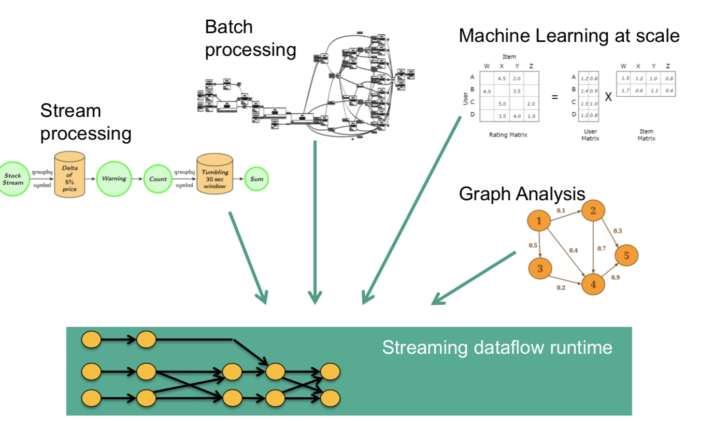
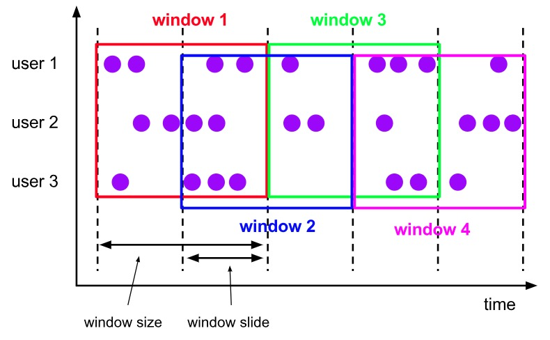

# Flink 

## 1. 基本介绍

### 1.1 流处理技术概览

#### 1.1.1 大数据计算模式

* **批量计算**

  * *  MapReduce

    *  Apache Spark

    *  Hive

    *  Flink

    *  Pig

* **流式计算**

  * *  Storm

    *  Spark Streaming

    *  Apache Flink

    *  Samza

* 交互计算

  * *  Presto

    *  Impala

    *  Druid

    *  Drill

* 图计算

  * *  Giraph（Facebook）

    *  Graphx（Spark）

    *  Gelly（Flink）

#### 1.1.2 流计算与批计算差异

* **数据时效性**
  * 流：实时、低延迟；批：非实时，高延迟
* 数据特征
  * 流：动态数据，没有边界
* **应用场景**
  * 流：时效性高；批：离线计算
* 运行方式
  * 流：持续进行；批：一次性完成
* **存储、计算**
  * 批：计算、存储成本高

#### 1.1.3 流计算框架差异

* **apache storm**
  * 优势
    * 最早使用的流处理框架，社区成熟
    * 支持原生流处理，即单事件来处理流数据（所有记录一个接一个处理）
    * 延迟低（毫秒级）
  * 劣势
    * 消息保证能力弱，消息传输可能重复但不会丢失
    * 吞吐量比较低
* **spark streaming**
  * 流程
    * 
  * 劣势
    * 以固定间隔（几秒钟），处理一段批处理作业，延迟性较高
  * 优势
    * 保证消息不会丢失也不会重复
    * 吞吐高
* flink
  * 真正的流处理框架（dataflow model）
  * 延长性低
  * 高吞吐
  * 保证消息不会丢失也不会重复
  * 支持原生流处理
* 差异比对图
  * 

### 1.2 Flink 发展历史及应用

* 发展历史
  * 
* 应用场景
  * 实施监控
    * 用户行为预警
    * 用户行为或相关事件实时监测分析，基于风控规则预警
  * 实时报表
    * 双11直播大屏
    * 数据化运营
  * 流数据分析
    * 内容投放、个性化推荐、智能推送
  * 实时数据仓库
    * 数据实时清洗、归并、结构化
    * 数仓的补充和优化

### 1.3 Flink核心特性

#### 1.3.1统一数据处理组件栈，处理不同需求（batch、stream、machine learning、gragh）

* 

#### 1.3.2 支持时间概念。事件时间、接入时间、处理时间

* 

#### 1.3.3 基于轻量级分布式快照实现容错

* 

#### 1.3.4 支持有状态计算

* support for very large state
* querable state支持
* 灵活的state-backend（HDFS、rocksdb、内存）

#### 1.3.5 带反压的连续流模型

* 

#### 1.3.6 内存管理特性

* 基于jvm实现独立内存管理（flink自己的内存管理）
* 对象序列化二进制存储
* 应用可超出主内存的大小限制，承受更少的垃圾收集开销

## 2. Flink部署与应用

### 2.1 Flink集群架构

* **集群总体架构**
  * 

#### 2.1.1 JobManager

* 功能：管理节点，管理整个集群计算资源，job管理与调度执行以及checkpoint协调
* 功能明细：
  * **Checkpoint Coordinator** 
    *  Checkpoint协调相关
  * **Actor System**
    * RPC通信
  * **Job Dispatch**
    * **接收Job**，提供了一个 REST 接口，用来提交 Flink 应用程序执行，并为每个提交的作业启动一个新的 **JobMaster**
    * 运行 Flink WebUI 用来提供作业执行信息
  * **ResourceManager**：
    * 集群资源管理，负责 Flink 集群中的资源提供、回收、分配 - 它管理 **task slots**
    * 不同的环境和资源提供者（例如 YARN、Mesos、Kubernetes 和 standalone 部署）实现了对应的 ResourceManager
    * 只能分配可用 TaskManager 的 slots，而不能自行启动新的 TaskManager
  * JobGraph-> Execution Graph
  * Task部署与调度
  * TaskManager注册与管理
  * 

#### 2.1.2 TaskManager

* 功能：提供计算资源
* 功能明细：
  * Task Execution
  * Network Manager
  * Shuffle Environment管理
  * Rpc通信（Actor system）
  * heartbeat with jobmanager And RM
  * Data Exchange
  * Memory Management
  * Register To RM
  * Offer Slots To JobManager
  * 

#### 2.1.3 Client

* 功能：本地执行main方法解析JobGraph对象，并提交到JobManager运行
* 功能明细：
  * app main方法的执行
  * JobGraph 生成
  * Execution Environment管理
  * Job 和依赖包提交
  * RPC with JobManager
  * 集群部署（Cluster Deploly）**。？？这个跟Client什么关系？？？**

#### 2.1.3 Job Graph介绍

* 说明
  * 通过有向无环图（Dag）方式，表达程序
  * flink1.11之前只能在client生成
  * 客户端与集群间Job描述的载体
  * 不同接口程序的抽象表达
  * 
  * 

### 2.2 Flink集群部署模式（Session、Per-Job、Application）

#### 2.2.1 集群部署模式分类指标

1. **集群的生命周期与资源隔离**
2. **程序的main在Client还是JobManager执行**

#### 2.2.2 Session 模式

* 特点
  * JobManager与TaskManager 所有Job共享
  * 客户端通过RPC或Rest API连接集群管理节点
  * 客户端需上传依赖jar
  * 客户端生成JobGraph，提交到JobManager
  * JobManager生命周期不受Job影响，会长期运行
  * 
* 优势
  * 资源充分共享，提升资源利用率
  * Job在集群中管理，运维简单
* 劣势
  * 资源隔离相对较差
  * 非Native类型部署，TM不易扩展，slot计算资源收缩性差

#### 2.2.3 Per-Job 模式

* 特点
  * 单个Job独享 JobManager与 Task Manager
  * TM中Slot资源根据Job指定
  * 客户端需上传依赖jar
  * 客户端生成JobGraph，提交到JobManager
  * JobManager的生命周期和Job生命周期绑定
  * 
* 优势
  * Job和Job之间资源隔离充分
  * 资源根据Job需要进行申请, TM Slots数量可以不同
* 劣势
  * 资源相对比较浪费, JobManager需要消耗资源
  * Job管理完全交给 ClusterManagement,管理复杂

#### 2.2.4 Application模式

* 特点
  * 每个 Application对应一个 JobManager,且可以运行多个Job
  * 客户端无需将 Dependencies上传到JobManager,仅负责管理Job的提交与管理
  * main(方法运行 JobManager中,将JobGraph的生成放在集群上运行,客户端压力降低
* 优势
  * 有效降低带宽消耗和客户端负载
  * Application实现资源隔离, Application中实现资源共享
* 劣势
  * 功能太新,还未经过生产验证
  * 仅支持Yan和 Kubunetes

### 2.3 集群资源管理器支持（Standalone、Yarn、Kubernates）

#### 2.3.1 集群部署对比

* 

#### 2.3.2 Native集群部署（仅Session模式存在Native）

* 特点
  * Session集群根据根据实际提交的Job资源动态申请和启动 Taskmanager计算资源
  * 支持 Native部署模式的有Yarn, Kubernetes, Mesos资源管理器
  * Standalone不支持 Native部署

* 

### 2.4 Standalone集群原理

#### 2.4.1 特点

* 分布式多台物理主机部署
* 依赖于Java8或Java11 JDK环境
* 仅支持 Session模式提交 Job
* 支持高可用配置

#### 2.4.2 Job提交流程

* 

#### 2.4.3 多机模式注意事项

* 每台节点都必须安装 JDK,并配置 JAVA_HOME路径和环境变量
* 如果需要用hdfs,则需要在每台节点需配置 HADOOP CONFIG_DIR环境变量
* 每台节点 Flink package路径保持一致,且版本保持一致
* 相关配置修改
  * 主要配置修改
  * 修改conf/fink-conf.yam文件,配置 jobmanager rpc. address: ${地址}
  * 修改conf/ master文件,设定 master节点为主节点地址
  * 修改conf/ Worker文件,设定work节点地址
  * 将修改后的配置文件同步到每台节点的$ FLINK HOME}/conf路径下

### 2.5 Flink On Yarn集群原理

#### 2.5.1 Yarn 架构

* 组件
  * Resource Manager (NM)
    * 负责处理客户端请求
    * 监控 Nodemanager
    * 启动和监控 APPLicationMaster
    * 资源的分配和调度
  * Node Manager
    * 管理单个 Worker节点上的资源;
    * 处理来自 ResourceManager的命令
    * 处理来自 Application Master的命令
    * 汇报资源状态
  * Application Master
    * 负责数据的切分
    * 为应用申请计算资源,并分配给Task
    * 任务的监控与容错
    * 运行在 Worker节点上
  * Container
    * 资源抽象,封装了节点上的多维度资源,如CPU,内存,网络资源等;
* 架构图
  * 

#### 2.5.2 Session模式提交（On Yarn ）

* 特点
  * 多 Jobmanager共享 Dispatcher和 YarnResource manager
  * 支持 Native模式,TM动态申请
* 流程图
  * 

#### 2.5.3 Per-Job模式提交（On Yarn）

* 特点
  * 单个 JobManager独享 YarnResource manager和 Dispatcher
  * Application Master与 Flink master节点处于同一个 Container

#### 2.5.4 优劣势

* 优势
  * 与现有大数据平台无缝对接( Hadoop2.4+)。
  * 部署集群与任务提交都非常简单
  * 资源管理统一通过Yarn管理,提升整体资源利用率类。
  * 基于 Native方式, TaskManager资源按需申请和启动,防止资源浪费。
  * 容错保证借助于 Hadoop Yarn提供的自动 failover机制,能保证JobManager, TaskManager节点异常恢复
* 劣势
  * 资源隔离问题,尤其是网络资源的隔离,Yarn做的还不够完善。
  * 离线和实时作业同时运行相互干扰等问题需要重视。
  * Kerberos认证超期问题导致 Checkpoint无法持久化。

#### 2.5.5 部署及注意事项

* 注意事项

  * Hadoop Yarn版本需要在2.4.1以上,且具有HDFS文件系统;
  * 该节点需要配置 HADOOP_CoNF_DR环境变量,并指向 Hadoop客户端配置路径;
  * 下载 Hadoop依赖包配置
    * FLink1.11版本后将不再在主版本中支持 flink- shaded- hadoop-2-uber包,用户需要自己
      指定 HADOOP CLASSPATH,或者继续到flink官网下载 Hadoop依赖包。

* 启动

  * Session集群启动

    * /bin/yarn- session. sh -im 1024m-tm 4096m

  * Job集群启动

    * /bin/flink run -m yarn-cluster-p4-yjm 1024m-ytm 4096m /examples/batch/Word Count jar

  * Application Mode集群启动

    * /bin/flink run -application-t yarn -application \

      -Djobmanager. memory. process size=2048m \
      -Dtaskmanager memory process size=4096m \
      -Dyarn provided. lib. dirs="hdfs: //node02: 8020/flink-training /flink-111" \
      ./MyApplication jar

### 2.6 Flink On Kubernates集群原理

#### 2.6.1 待补充

### 2.7 Flink集群高可用

#### 2.7.1 待补充

## 3.Flink DataStream API使用与说明

### 3.1分布式流处理模型（DataFlow）

* 数据流关注点
  * **正确性、延迟、大规模的成本、无界、无序的数据处理**
* 流模型图
  * 
* 多并发度流模型的特性
  * 数据从上一个 Operation节点直接**Push**到下一个 Operation节点。
  * 各节点可以分布在不同的Task线程中运行,数据在 Operation之间传递。
  * 具有 Shuffle过程,但是数据不像 MapReduce模型, Reduce从Map端拉取数据（flink是上游push）。
  * 实现框架有 Apache Storn和 Apache Flink以及 Apache beam。
  * 

### 3.2 DataStream API架构及使用

#### 3.2.1 API架构


####  3.2.2 Flink demo 解读

* 

* 相关类介绍

  * 运行环境（StreamExecutionEnvironment）

    * 功能

    

  * Data Stream数据源

    * 使用说明

      

    * Datastream基本数据源的使用

      ```
      /从给定的数据元素中转换
      DataStreamSource<OUT> fromElements(OUT. data)
      
      /从指定的集合中转换成 Datastream
      DataStreamSource<OUT> fromCollection( Collection<OUT> data)
      
      //读取文件并转换
      DataStreamSource<OUT> readFile(filelnputFormat<OUT> inputFormat, String filepath)
      
      //从 Socket端口中读取
      DataStreamSource<String> socketTextstream(string hostname int port String delimiter)
      
      //直接通过InputFormat创建
      DataStreamSource<OUT> createInput(InputFormat<OUT, ? inputFormat
      
      最终都是通过 Execution environment创建 from source(方法转换成 Datastream source)
      ```

    * DataStream 数据源连接器的使用

      * Flink 内置的Connector：

        *  Apache Kafka (source/sink)

        *  Apache Cassandra (sink)

        *  Amazon Kinesis Streams (source/sink)

        *  Elasticsearch (sink)

        *  Hadoop FileSystem (sink)

        *  RabbitMQ (source/sink)

        *  Apache NiFi (source/sink)

        *  Twitter Streaming API (source)

        *  Google PubSub (source/sink)

        *  JDBC (sink)

      * 例子：Kafka 连接器使用

        * 1.引入依赖

          * ```
            <dependency>
            
            <groupId>org.apache.flink</groupId>
            
            <artifactId>flink-connector-kafka_2.11</artifactId>
            
            <version>1.11.0</version>
            
            </dependency>
            ```

        * 2.配置属性，把数据源添加到env中

          * ```
            Properties properties = new Properties();
            properties.setProperty("bootstrap.servers", "localhost:9092");
            properties.setProperty("group.id", "test");
            DataStream<String> stream = env.addSource(new FlinkKafkaConsumer<>("topic",
            new SimpleStringSchema(), properties));
            ```

            * 这里的FlinkKafkaConsumer就是source operator

#### 3.2.3 DataStream 转换操作

* 转换操作类型
  * 


* 转换具体操作
  * 

* DataSteam间的转换
  * 

* DataStream物理分组操作
  * 

### 3.3 Time & Watermark & Windows

#### 3.3.1 概念介绍

* Time
  * event time : 事件发生的时间
  * storage time：进入消息队列的时间
  * ingestion time：接入flink中的时间
  * processing time：处理时间

* Watermark

  * 功能

    * 解决乱序的事件处理，保证在一定窗口的时间段内事件的有效性（小于watermark的事件都已过期，失效）

  * 实现

    * maxOutOfOrderness = 4

    * 1. 当有**新的最大时间戳**出现时，source operator就会基于maxOutOfOrderness产生新的Watermark 

         (注：此处为**Periodic** watermark生成方式（常用方式），Punctuated watermark生成方式不基于最大时间戳，而是通过event stream 里面的一些属性，比如某个字段是否存在来判断是否产生一个新的watermark)

      2. 如上图事件7到来时，此时没有事件发生，所以会生成一个watermark，（= 最大事件戳-maxOutOfOrderness），即为3，插入stream中，此时，当后续operator收到事件的时间戳小于3，则说明失效直接丢弃

      3. 这样就保证了即使stream是无序的，但如果事件的时间戳的误差范围大于maxOutOfOrderness，则直接丢弃。（maxOutOfOrderness即可理解为最大的误差范围，只要事件的时间戳在这范围以内都可以接受）

  * **Periodic** watermark例子

    * 

  * Punctuated watermark例子

    * 

* Windows

  * 概念

    * Windows are at the heart of processing infinite streams. Windows split the stream into “buckets” of finite size, over which we can apply computations. 

    * ```
      Windows 是处理无限流的核心。 Windows 将流拆分为有限大小的“桶”，我们可以对其进行计算。
      ```

  * **支持的窗口类型**
    * 
    * 按时间划分窗口
      * Sliding Window（滑动窗口）
        * 涉及相关的概念
          * Window Size：窗口大小
          * Window Slide：滑动间隔
        * 滑动窗口的定义
          * 滑动窗口以一个步长（Slide）不断向前滑动，窗口的长度固定
        * 特点
          * 数据可以被重复计算，取决于Size 和Slide Time
            * Slide Time < Window Size 数据在多个窗口中统计
            * Slide Time > Window Size：数据可能不再任何一个Window 中
        * 例子
          * 每隔5 min 统计前10 min 的总数
          * 此时Slide Time=5min，Window Size =10min 那么每隔5分钟统计一次窗口的总数，5-10分钟的数据就会被计算两次
          * 
      * Tumbliing Window（滚动窗口）
        * 概念
          * 滚动窗口是特殊的滑动窗口，**滑动间隔 Slide Time= 窗口大小Window Size**
        * 例子
          * 每隔5分钟统计一次总数
          * 
      * Session Window
        * 概念
          * 根据Session gap 切分不同的窗口，当一个窗口在大于Session gap 的时间内没有接收到新数据时，窗口关闭。
        * 特点
          * Window Size 可变
        * 例子
          * 如近5分钟没有数据，就进行一次窗口统计
          * 
      * Global Window
        * 概念
          * **所有的元素都在一个窗口中**，上述的三种类型可以理解为都是基于global window，按指定的窗口大小和特定的trigger触发条件做划分
        * 
    * 按次数划分窗口
      * 滚动count
      * 滑动count
  * windows处理流程
    
    * 

#### 3.3.2 windows使用

* 

* 相关概念

  * Window Assigner

    * 功能：将数据流中的**元素**按照**既定的规则分配到对应的窗口**
    * 特点：
      * flink自带的一些Assigner实现类都携带**默认的窗口触发条件（Trigger）和过滤条件（Evictor）**
      * 额外添加Trigger和Evictor会覆盖原有的默认实现

  * Window Trigger

    * 功能：决定了何时启动Window Function 来处理窗口中的数据以及何时将窗口内的数据清理

    * 内置trigger

      * 

    * Trigger抽象类方法

      * The `onElement()` method is called for each element that is added to a window.
      * The `onEventTime()` method is called when a registered event-time timer fires.
      * The `onProcessingTime()` method is called when a registered processing-time timer fires.
      * The `onMerge()` method is relevant for stateful triggers and merges the states of two triggers when their corresponding windows merge, *e.g.* when using session windows.
      * Finally the `clear()` method performs any action needed upon removal of the corresponding window.

    * Trigger方法说明

      * onElement、onEventTime、onProcessingTime通过这三个方法去实现是否触发逻辑，通过返回枚举对象TriggerResult（CONTINUE、FIRE、PURGE）来控制是否触发窗口处理数据，任一一个方法返回FIRE都触发，所以可以基于element元素的到来，也可以基于时间来触发

    * 例子

      * ```
        EventTimeTrigger ：基于eventTime时间来触发
        
        @Override
        	public TriggerResult onElement(Object element, long timestamp, TimeWindow window, TriggerContext ctx) throws Exception {
        		if (window.maxTimestamp() <= ctx.getCurrentWatermark()) {
        			// if the watermark is already past the window fire immediately
        			return TriggerResult.FIRE;
        		} else {
        			ctx.registerEventTimeTimer(window.maxTimestamp());
        			return TriggerResult.CONTINUE;
        		}
        	}
        
        	@Override
        	public TriggerResult onEventTime(long time, TimeWindow window, TriggerContext ctx) {
        		return time == window.maxTimestamp() ?
        			TriggerResult.FIRE :
        			TriggerResult.CONTINUE;
        	}
        
        	@Override
        	public TriggerResult onProcessingTime(long time, TimeWindow window, TriggerContext ctx) throws Exception {
        		return TriggerResult.CONTINUE;
        	}
        ```

  * Window Evictor

    * 功能：排除掉某些element，在执行 window function之前或者之后

    * 疑问：在function之后排除有什么用？？

    * 例子(CountEvictor : 当数量大于设定的数量时，排除掉最前面的多出来的element)

    * ```
      @Override
      	public void evictBefore(Iterable<TimestampedValue<Object>> elements, int size, W window, EvictorContext ctx) {
      		if (!doEvictAfter) {
      			evict(elements, size, ctx);
      		}
      	}
      
      	@Override
      	public void evictAfter(Iterable<TimestampedValue<Object>> elements, int size, W window, EvictorContext ctx) {
      		if (doEvictAfter) {
      			evict(elements, size, ctx);
      		}
      	}
      
      	private void evict(Iterable<TimestampedValue<Object>> elements, int size, EvictorContext ctx) {
      		if (size <= maxCount) {
      			return;
      		} else {
      			int evictedCount = 0;
      			for (Iterator<TimestampedValue<Object>> iterator = elements.iterator(); iterator.hasNext();){
      				iterator.next();
      				evictedCount++;
      				if (evictedCount > size - maxCount) {
      					break;
      				} else {
      					iterator.remove();
      				}
      			}
      		}
      	}
      ```

    * 

  * Window Function

    * 分类
      * ReduceFunction
        * 特点：增量计算，窗口只保存上次处理过的数据，且输入输出同类型
      * AggregateFunction
        * 增量计算，窗口只保存上次聚合之后的结果数据
      * ProcessWindowFunction
        * 特别之处：会保存整个窗口的全部数据，每次计算都可以获取到全部的窗口元数据

  * SideOutput

    * 功能：对流进行拆分，直接使用在ProcessFunction进行定义筛选逻辑

    * 代码

      * ```
        DataStream<Integer> input = ...;
        
        final OutputTag<String> outputTag = new OutputTag<String>("side-output"){};
        
        SingleOutputStreamOperator<Integer> mainDataStream = input
          .process(new ProcessFunction<Integer, Integer>() {
        
              @Override
              public void processElement(
                  Integer value,
                  Context ctx,
                  Collector<Integer> out) throws Exception {
                // emit data to regular output
                out.collect(value);
        
                // emit data to side output
                ctx.output(outputTag, "sideout-" + String.valueOf(value));
              }
            });
        
        DataStream<String> sideOutputStream = mainDataStream.getSideOutput(outputTag);
        ```

#### 3.3.3 window多流合并

* window join
  * 特点：基于相同的窗口进行合并，窗口的类型要一致，只合并两个流中都存在的元素。
  * 疑惑：
    * notes：
      * Those elements that do get joined will have as their timestamp the largest timestamp that still lies in the respective window. For example a window with `[5, 10)` as its boundaries would result in the joined elements having 9 as their timestamp. 这句话怎么理解？
  * 分类（这三类只是window划分的区别，join的逻辑都是跟上述的特点一致）
    * Session Window Join 
      * 
    * Sliding Window Join
      * 
    * Tumbling Window Join
      * 
* interval join
  * 特点：
    * 定义了两个上下界的误差范围（下界：lowerBound，上界：upperBound），在这个区间内，都属于可以连接的元素
    * 公式：orangeElem.ts + lowerBound <= greenElem.ts <= orangeElem.ts + upperBound
  * 例子：
    * 橙色intervalJoin绿色，lowerBound=-2，upperBound=1，此时，橙元素2，可连接的元素有绿色0、1，橙色2的连接区间为绿色值域[0,3]
    * 

### 3.4 Process Function

* 介绍

  * 低阶流处理算子（可参考3.2.1API架构），可以访问流应用程序所有（非循环）基本构建块：

    *  事件（数据流元素）

    *  状态（容错和一致性）

    *  定时器（事件时间和处理时间）

* 数据处理节点

  * 对于每一个接入的数据元素

    * ```
      /**
      * Process one element from the input stream.
      */
      void processElement(I value, Context ctx, Collector<O> out) throws Exception;
      ```

    * 可执行的操作

      * 更新数据状态
      * 注册未来某一时间需要调用的callback 回调函数

  * 当某一时间到来后

    * ```
      /**
      * Called when a timer set using {@link TimerService} fires.
      */
      void onTimer(long timestamp, OnTimerContext ctx, Collector<O> out) throws
      Exception;
      ```

    * 可执行的操作

      * 检查条件是否满足，并执行对应的行为，例如输出数据元素等

  * 例子

    * 实现的功能

      * 记录每个传入的Key 的counts 数量
      * 如果指定的Key 在最近100ms（Event Time）没有接收到任何Element，则输出key/count 键值对

    * 实现逻辑

      * 1. 存储count 值，key 以及最后更新的TimeStamp 到ValueState 中，ValueState 由key隐含定义；

        2. 对于每条记录

           更新计数器并修改最后的时间戳， 注册一个100ms timer 计时器，起始时间从当前的EventTime 开始

        3. Times 被回调时：

           检查存储计数的最后修改时间与回调的事件时间TimeStamp，如果匹配则发送键/计数键值对（即在100ms内没有更新）

    * 代码

      * ```
        // the data type stored in the state
        public class CountWithTimestamp {
        public String key;
        public long count;
        public long lastModified;
        }
        // apply the process function onto a keyed stream
        DataStream<Tuple2<String, Long>> result = stream
        .keyBy(0)
        .process(new CountWithTimeoutFunction());
        
        public class CountWithTimeoutFunction extends
        RichProcessFunction<Tuple2<String, String>, Tuple2<String, Long>> {
        @Override
        public void processElement(Tuple2<String, Long> value, Context ctx,
        Collector<Tuple2<String, Long>> out) throws Exception {
        CountWithTimestamp current = state.value();
        if (current == null) {
        current = new CountWithTimestamp();
        current.key = value.f0;
        }
        current.count++;
        current.lastModified = ctx.timestamp();
        state.update(current);
        ctx.timerService().registerEventTimeTimer(current.lastModified + 100);
        }
        
        @Override
        public void onTimer(long timestamp, OnTimerContext ctx,
        Collector<Tuple2<String, Long>> out) throws Exception {
        CountWithTimestamp result = state.value();
        if (timestamp == result.lastModified + 100) {
        out.collect(new Tuple2<String, Long>(result.key, result.count));
        state.clear();
        }
        }
        }
        ```

### 3.5 Asynchronous I/O 异步操作

* 功能：异步I/O操作

* 特点

  * 通过缓存一批数据，再发起异步调用，支持有序和无序（有序：：根据数据元素到达算子的先后关系进行输出；无序：根据数据查询完成的先后进行输出）

* 代码

  * ```
    public interface AsyncFunction<IN, OUT> extends Function, Serializable {
    /**
    * Trigger async operation for each stream input.
    */
    void asyncInvoke(IN input, ResultFuture<OUT> resultFuture) throws Exception;
    /**
    * {@link AsyncFunction#asyncInvoke} timeout occurred.
    * By default, the result future is exceptionally completed with a timeout exception.
    */
    default void timeout(IN input, ResultFuture<OUT> resultFuture) throws Exception {
    resultFuture.completeExceptionally(
    new TimeoutException("Async function call has timed out."));
    }
    }
    ```

* 使用例子

  * 

  * ```
    /**
     * An implementation of the 'AsyncFunction' that sends requests and sets the callback.
     */
    class AsyncDatabaseRequest extends RichAsyncFunction<String, Tuple2<String, String>> {
    
        /** The database specific client that can issue concurrent requests with callbacks */
        private transient DatabaseClient client;
    
        @Override
        public void open(Configuration parameters) throws Exception {
            client = new DatabaseClient(host, post, credentials);
        }
    
        @Override
        public void close() throws Exception {
            client.close();
        }
    
        @Override
        public void asyncInvoke(String key, final ResultFuture<Tuple2<String, String>> resultFuture) throws Exception {
    
            // issue the asynchronous request, receive a future for result
            final Future<String> result = client.query(key);
    
            // set the callback to be executed once the request by the client is complete
            // the callback simply forwards the result to the result future
            CompletableFuture.supplyAsync(new Supplier<String>() {
    
                @Override
                public String get() {
                    try {
                        return result.get();
                    } catch (InterruptedException | ExecutionException e) {
                        // Normally handled explicitly.
                        return null;
                    }
                }
            }).thenAccept( (String dbResult) -> {
                resultFuture.complete(Collections.singleton(new Tuple2<>(key, dbResult)));
            });
        }
    }
    
    // create the original stream
    DataStream<String> stream = ...;
    
    // apply the async I/O transformation
    DataStream<Tuple2<String, String>> resultStream =
        AsyncDataStream.unorderedWait(stream, new AsyncDatabaseRequest(), 1000, TimeUnit.MILLISECONDS, 100);
    
    ```

### 3.6 StreamGraph 与JobGraph 的转换

* 步骤
  * 把所有的算子转化操作，抽象成transformation对象，并按顺序添加到env上下文的transformations（List对象）中。
    * 
    * streampoeratorfactory提供了实例化operator对象的功能
  * 把streamdataflow转成streamGraph
    * 把streamoperator转成streamNode
    * 对node之间通过streamedgeEdge
  * streamGraph生成jobGraph
    * steamNode对应verterx
    * 中间结果
  * JobGraph 生成Execution Graph（jobmanager执行）

### 3.7 Flink 类型系统

* TypeInformation 作用（flink中指定对应的类型的作用）：
  * Flink对数据类型了解得越多，序列化和数据Schema布局就越好，数据处理也更方便；
  *  在大多数情况下，可以使用户不必担心序列化框架和以及类型注册；
  * 基于Flink 自身的数据序列化能力，可以直接将数据序列化成二进制数据格式存储在内存中；

* Flink 类型分类
  * 
  *  

* flink中Values类型
  * value中主要的类型
    * ByteValue,ShortValue, IntValue, LongValue, FloatValue, DoubleValue, StringValue, CharValue, BooleanValue
  * value类型的优势
    * 和普通数据类型基本功能一样，就是做了一些性能上的升级
      * 实现org.apache.flinktypes.Value 接口，实现了更高效的序列化和反序列化能力；
      * 可以支持修改，对象复用，以及基于二进制数据密集型存储，减轻GC 压力以及内存消耗等

* 创建TypeInformation
  * 通常情况下Flink 会根据Function 签名和子类自动生成TypeInformation，无需用户指定
  * Java 会在执行过程中将泛型类型擦除，因此数据类型中如果使用到**泛型，此时就需要显性**的

### 3.8 自定义Source 与Sink

* 实现

  * 流处理

    * 通过继承sourcefunction接口

    * ```
      public interface SourceFunction<T> extends Function, Serializable {
      void run(SourceContext<T> ctx) throws Exception;
      void cancel();
      interface SourceContext<T> {
      void collect(T element);
      @PublicEvolving
      void collectWithTimestamp(T element, long timestamp);
      @PublicEvolving
      void emitWatermark(Watermark mark);
      @PublicEvolving
      void markAsTemporarilyIdle();
      Object getCheckpointLock();
      void close();
      }
      }
      ```

  * 批处理

    * 继承inputFormat接口

    * ```
      public interface InputFormat<OT, T extends InputSplit> extends InputSplitSource<T>, Serializable {
      void configure(Configuration parameters);
      BaseStatistics getStatistics(BaseStatistics cachedStatistics) throws IOException;
      @Override
      T[] createInputSplits(int minNumSplits) throws IOException;
      @Override
      InputSplitAssigner getInputSplitAssigner(T[] inputSplits);
      void open(T split) throws IOException;
      boolean reachedEnd() throws IOException;
      OT nextRecord(OT reuse) throws IOException;
      void close() throws IOException;
      }
      ```

* 批流一体（beta版尚未发布，以后的方向，统一批流处理方式）
  * 三个核心组件
    * Split
    * SourceReader
    * SplitEnumerator

## 4.有状态计算、状态管理与容错 

### 4.1 有状态计算概要

* 传统流计算（无状态）存在的问题
  * 主要是存在性能问题
  * 
* 有状态计算需要解决的问题
  * 
  * 

### 4.2 state说明及使用

#### 4.2.1 state类型

* 分类
  * 
* Keyed State 与 Operator State差异
  * 

#### 4.2.2 Keyed State

* 使用的前置条件

  * DataStream需要先经过keyby（）方法转化为KeyedStream才可以使用keyed state

* 分类

  * ValueState<T>
    * 保存一个value对象，通过`update(T)`和`T value()`更新读取。

  * ListState<T>
    * 保存一个list对象，通过`add(T)`和`addAll(List<T>)和update(List<T>)和Iterable<T> get()`. 来添加替换读取。
  * ReducingState<T>
    * 保存一个value对象，汇总所有添加的element，通过使用ReduceFunction
  * AggregatingState<IN, OUT>
    * 与ReducingState不同之处在于，输入对象和汇总后生成的对象类型可以不同
  * MapState<UK, UV>
    * 保存一个map对象

* 特点：

  * state有可能保存在磁盘上或者其他地方，不一定保存在内部

  * 对于每个不同的key，都有一个state对象，各自独立，不同的key取到的state的值不同

  * 通过RuntimeContext定义state对象，由state name作为唯一标识符，属性通过new Descriptor对象来设置，并添加到上下文中。

    * 例子

    * ```
      public class CountWindowAverage extends RichFlatMapFunction<Tuple2<Long, Long>, Tuple2<Long, Long>> {
      
          /**
           * The ValueState handle. The first field is the count, the second field a running sum.
           */
          private transient ValueState<Tuple2<Long, Long>> sum;
      
          @Override
          public void open(Configuration config) {
              ValueStateDescriptor<Tuple2<Long, Long>> descriptor =
                      new ValueStateDescriptor<>(
                              "average", // the state name
                              TypeInformation.of(new TypeHint<Tuple2<Long, Long>>() {}), // type information
                              Tuple2.of(0L, 0L)); // default value of the state, if nothing was set
              sum = getRuntimeContext().getState(descriptor);
          }
      }
      
      ```

* State Time-To-Live (TTL)

  * 功能：为state设置有效时间

  * 例子

    * ```
      StateTtlConfig ttlConfig = StateTtlConfig
          .newBuilder(Time.seconds(1))
          .setUpdateType(StateTtlConfig.UpdateType.OnCreateAndWrite)
          .setStateVisibility(StateTtlConfig.StateVisibility.NeverReturnExpired)
          .build();
          
      ValueStateDescriptor<String> stateDescriptor = new ValueStateDescriptor<>("text state", String.class);
      stateDescriptor.enableTimeToLive(ttlConfig);
      ```

    * update type

      * StateTtlConfig.UpdateType.OnCreateAndWrite (default): only on creation and write access
      * StateTtlConfig.UpdateType.OnReadAndWrite : also on read access

    * visibility

      * `StateTtlConfig.StateVisibility.NeverReturnExpired` (default)- expired value is never returned
      * `StateTtlConfig.StateVisibility.ReturnExpiredIfNotCleanedUp` - returned if still available

  * 清理策略

    * 默认：在read的时候，读到过期的数据进行清理

    * Cleanup in full snapshot

      * 清理过期的state在checkpoint全量快照的时候

      * 使用：

        * ```java
          StateTtlConfig ttlConfig = StateTtlConfig
              .newBuilder(Time.seconds(1))
              .cleanupFullSnapshot()
              .build();
          ```

      * 不适用场景：state备份的方式为增量RocksDB的话，此策略无法使用

    * Incremental cleanup

      * 使用：.cleanupIncrementally(10, true)
        * 在每次访问状态时被触发清理
        * 参数（10）:每次清理时检查状态条目的数量，默认为5条
        * 参数（true）：是否在每次记录处理时额外触发清理，默认为false不清理
      * 说明：
        * 只适用于 Heap state backend，对于RocksDB backend不生效
        * 如果没有对状态进行访问或没有处理任何记录，过期状态将保持

    * Cleanup during RocksDB compaction 

      * 

#### 4.2.3 Operator State 

* Operator State 定义

  * 单Operator 具有一个状态，不区分Key

  * State 需要支持重新分布

  * 不常用，主要用于Source 和Sink 节点，像KafkaConsumer 中，维护Offset，Topic 等信息；

  * 实例：BufferSink

* 三种状态类型：

  * ListState

  * UnionListState

  * BroadcastState

* 两种定义方式：

  * 实现CheckpointedFunction 接口定义

    * ```
      void snapshotState(FunctionSnapshotContext context) throws Exception;
      
      void initializeState(FunctionInitializationContext context) throws Exception;
      ```

  * 实现ListCheckpointed 接口定义(Deprecated)

#### 4.2.4 Broadcast State

### 4.3 checkpoint & savepoint

#### 4.3.1 checkpoint

* checkpoint 执行过程
  * 
* 对齐
  * checkpoint barrier 存在对齐的过程阻塞，所以会影响性能
* V1.11版本引入**Unaligned Checkpointing**解决

* checkpoint配置

#### 4.3.2 savepoint

* 与checkpoint差异
  * 

* Savepoint 客户端命令人工触发

  * ```
    *  Trigger a Savepoint
    $ bin/flink savepoint :jobId [:targetDirectory]
    *  Trigger a Savepoint with YARN
    $ bin/flink savepoint :jobId [:targetDirectory] -yid :yarnAppId
    *  Cancel Job with Savepoint
    $ bin/flink cancel -s [:targetDirectory] :jobId
    *  Resuming from Savepoints
    $ bin/flink run -s :savepointPath [:runArgs]
    *  Allowing Non-Restored State
    $ bin/flink run -s :savepointPath -n [:runArgs]
    *  Disposing Savepoints
    $ bin/flink savepoint -d :savepointPath
    ```

### 4.4 state backend

* 功能：对持久化的管理
* 划分
  * 

#### 4.4.1 MemoryStateBackend（默认后端状态管理器）

* 构造方法

  env.setStateBackend(new MemoryStateBackend( "file://" + baseCheckpointPath, null).configure(conf, classLoader))

* 数据存储

  * State 数据存储在TaskManager 内存中

  * Checkpoint 数据数据存储在JobManager 内存

* 容量限制
  *  单词State maxStateSize 默认为5M
  * maxStateSize <= akka.framesize 默认10M
  * 总大小不能超过JobMananger 的内存

* 推荐场景：
  * 本地测试
  * 状态比较少的作业
  * 不推荐生产环境中使用

#### 4.4.2 FsStateBackend

* 构造方法：env.setStateBackend( new FsStateBackend(tmpPath))
* 数据存储
  * 状态数据：TaskManager 内存
  *  Checkpoint：外部文件系统（本地或HDFS）
* 容量限制
  * 单个TaskManager上State 总量不能超过TM内存
  * 总数据大小不超过文件系统容量
* 推荐场景
  * 常规状态作业
  * 窗口时间比较长，如分钟级别窗口聚合，Join 等
  *  需要开启HA 的作业
  *  可在生产环境中使用

#### 4.4.3 RocksDBStateBackend

* 创建方法（建议使用增量checkpoints方式）

  env.setStateBackend(new RocksDBStateBackend("file://" + baseCheckpointPath).configure(conf,

  classLoader))

* 数据存储

  *  State：TaskManager 中的KV 数据库（实际使用内存+磁盘）

  *  Checkpoint：外部文件系统（本地或HDFS）

* 容量限制：

  *  单TaskManager 上State 总量不超过其内存+ 磁盘大小

  *  单Key 最大容量2G

  *  总大小不超过配置的文件系统容量

* 推荐场景：

  *  超大状态作业

  *  需要开启HA 的作业

  *  对状态读写性能要求不高的作业
  *  推荐生产环境使用

### 4.5 应用升级对持久化的影响

#### 4.5.1 影响点

*  Code Update
   *  业务计算逻辑发生变化
   *  State 发生改变，无法直接从Old State 中恢复作业

*  Pipeline topology 发生改变
   *  增加和删除Operators

*  Job 重新配置
   *  Rescale job/ Operator Parallelism
   *  Swapping state backend

#### 4.5.2 状态结构更新解决方案

* 例子： 增加state实体增加一个字段

* flink数据类型的支持情况

  * POJO types

    *  删除字段
       *  字段删除后，删除字段对应的原有值将在新的检查点和保存点中删除
    *  添加新字段
       *  新字段将初始化为其类型的默认值，如Java 所定义的那样

    *  定义的字段其类型不能更改（不同类型占用空间不同）
    *  POJO 类型的Class Name 不能更改，包括类的命名空间

  * Avro types

    *  Flink 完全支持Avro 类型状态的模式演进，只要Avro 的模式解析规则认为模式更改是兼容的

    *  不支持键的模式演化

    *  Kryo 不能用于模式演化

### 4.6 序列化

* 基于堆内存的序列化
  * FsStateBackend
  * MemoryStateBackend
  * 特点
    * 本地内存中存储的是object未序列化的对象，在持久化的时候进行序列化
* 基于外部存储的序列化
  * RocksDBStateBackend
  * 特点
    * 基于本地堆外内存和磁盘，在本地时已进行序列化存储，持久化时，只做一个传输操作（已序列化完毕）
    * 基于序列化后的文件读入本地时，也不进行反序列化，只有在真正要使用时进行反序列化，因为在本地的方式，就是序列化后的对象

### 4.7 querable state

* 功能：可以让flink内部的state数据支持可查询

* 结构
  * 
* 流程
  * 

* flink提供两种查询state方式
  * 在线
    * 通过querable state
    * 特点
      * 准确，不依赖外部数据库再转一道持久化的操作
      * 缺点就是如果查询过于频繁和量大会影响在线的任务执行
  * 离线
    * savepoint存储离线数据文件，通过分析文件去获取state状态

